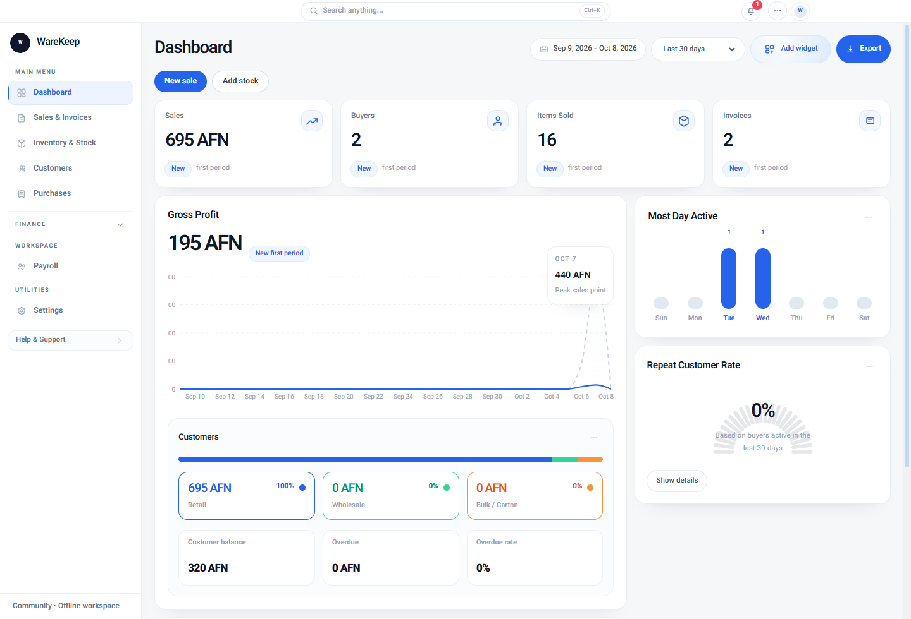
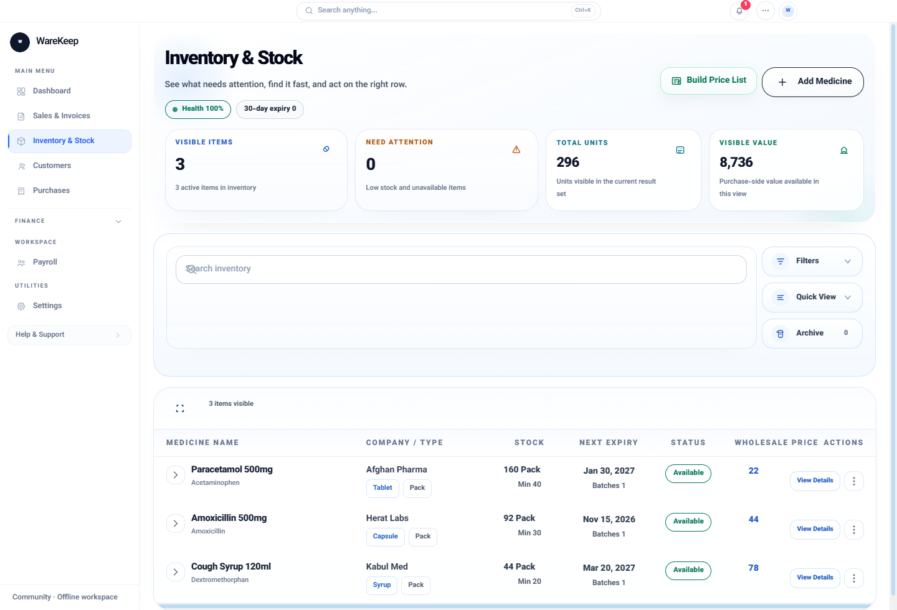

# WareKeep Community

An offline inventory, sales, and purchasing application for a business on a single computer. Community's core features work without an online account, subscription activation, API key, or commercial server.

English is the default interface language for a fresh workspace, with the Gregorian calendar and the device's local time zone. Persian/Dari remains available in **Settings → General**. Changing the language does not convert existing currencies or amounts. For a nontechnical introduction, read [First steps](docs/FIRST_STEPS.md).

## Download for Windows

**WareKeep Community 1.0.10 · Windows x64**

- [Download Setup](https://github.com/fazlafghan8-svg/warekeep-community/releases/download/v1.0.10/WareKeep-Community-Setup-1.0.10-x64.exe) — installs the application and adds a shortcut; recommended for regular use.
- [Download Portable](https://github.com/fazlafghan8-svg/warekeep-community/releases/download/v1.0.10/WareKeep-Community-Portable-1.0.10-x64.exe) — runs without installing the application.
- [Installation and first-use guide](docs/WINDOWS_INSTALL.md) — choose a download, add an item, record a sale, and save a backup.
- [Release notes and all downloads](https://github.com/fazlafghan8-svg/warekeep-community/releases/tag/v1.0.10).

Internet access is needed to download the files. Afterward, core features work offline without an online account or paid subscription. Both downloads are unsigned and may show a Windows publisher warning. Installation and first-use checks passed on the maintainer's Windows computer; a second computer has not yet been tested. Export a backup before updating or switching packages.

## Screenshots

These screenshots show the real Community application with made-up demonstration records.





The [official public repository](https://github.com/fazlafghan8-svg/warekeep-community) contains the Community source, and private vulnerability reporting is enabled. Check [GitHub Actions](https://github.com/fazlafghan8-svg/warekeep-community/actions) for the workflow results associated with the version you use.

## Features

- Product and medicine records, inventory, batches, and expiry dates.
- Purchases, sales, invoices, customers, and suppliers.
- Local reports, business accounts, and expense records.
- Local users and PIN access controls.
- Local backup export and restore.

Online accounts, subscription activation, payment services, cloud synchronization, online device management, and networked AI services are excluded from this source. Shared code needed by the offline application is public, including code that is also used in a separate commercial edition. See the [source scope](docs/OPEN_SOURCE_SCOPE.md).

## Run from source

Use **Node.js 24**. The build tools require at least Node.js **22.12.0**. Installing dependencies initially requires internet access. Offline operation refers to using the prepared application afterward.

```sh
git clone https://github.com/fazlafghan8-svg/warekeep-community.git
cd warekeep-community
npm ci
npm run dev
```

Open the local address shown in the terminal. Core features do not require an `.env` file, API key, or commercial database.

For a production browser build:

```sh
npm run build
npm run preview
```

Browser records belong to that browser profile and site address. Clearing browser storage can remove them. Export backups before relying on a workspace; desktop persistence and restore must also be checked for the version you use.

## Build the Windows application from source

```sh
npm run electron:dev
npm run electron:build
```

Windows packages are written to `release/community`. Verify a newly built package in a fresh test workspace before distributing it. Do not assume an executable is digitally signed; unsigned packages may trigger a Windows publisher warning.

The build uses stable `electron-builder 26.15.3` and a scoped `app-builder-lib` override to `@electron/get 5.1.0` to remove the old HTTP-cache dependency chain. This affects build downloads and does not make the installed application depend on internet access.

The downloader uses Fetch. Old Got-specific `timeout.request`, custom `agent` options, and retry assumptions based on `response.statusCode` are incompatible. The Community build uses no custom Got settings. Enable the downloader's official proxy route with `ELECTRON_GET_USE_PROXY=true`. Test downloads in the network configuration used for your build.

Each build step has a 20-minute deadline. A hung step and its child processes are stopped on Windows and the build fails. Application backup operations are unrelated to this deadline. More detail is in the [publication guide](docs/OPEN_SOURCE_STEPS.md).

## Check a change

```sh
npm audit
npm run typecheck
npm run lint
npm run verify:dependency-notices
npm run test:source-export
npm run test:unit
npx playwright install chromium
npm run test:e2e:community
npm run build
npm run verify:artifacts -- dist
```

For packaged desktop checks, build the Windows application and run `npm run test:community:desktop`. Record results against the exact source commit and executable. An older edition's successful checks do not establish that this edition passed. GitHub CI status must come from an actual workflow run.

As a practical check, add a made-up product with quantity 10, sell 2, and verify quantity 8 after closing and reopening. Export a backup and restore it into an empty test workspace. The 1.0.10 download's Setup installation, Portable launch, sale, restart, and backup restoration checks passed on the maintainer's computer. Testing on another computer, physical printing, data encryption, and persistence beyond three days require separate checks. See the [download guide](docs/WINDOWS_INSTALL.md#what-was-checked-for-this-release) for the release's test scope.

## License and contribution

The public source is licensed under **Apache-2.0**; [LICENSE](LICENSE) contains the authoritative terms. Commercial use is permitted under those terms for the owner and other recipients. Rights to already published versions remain with their recipients. Read the [plain-language license explanation](docs/COMMUNITY_LICENSE.md), [third-party notices](THIRD_PARTY_NOTICES.md), and [dependency inventory](THIRD_PARTY_DEPENDENCIES.md).

The owner states that they created the application-specific code, including with AI assistance, and did not include someone else's proprietary code without permission. This is an owner statement, not an independent legal determination; third-party licenses and asset notices still apply.

Contributions to the code, English documentation, and English and Persian/Dari interfaces are welcome. See [CONTRIBUTING.md](CONTRIBUTING.md).

## Security and support

GitHub private vulnerability reporting is enabled. Use the repository's [Security advisories](https://github.com/fazlafghan8-svg/warekeep-community/security/advisories) and follow [SECURITY.md](SECURITY.md). Do not disclose vulnerability details or private records in public issues.

No OpenAI support application has been submitted for this project. This project does not claim OpenAI endorsement or acceptance into a support program. A future application must follow the current [Codex for Open Source](https://developers.openai.com/community/codex-for-oss) requirements using accurate evidence. Publishing the repository does not guarantee six months of ChatGPT Pro.
